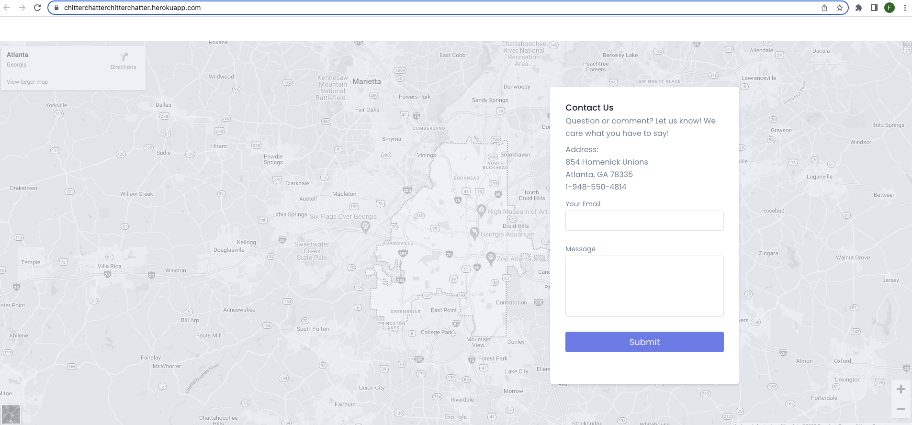
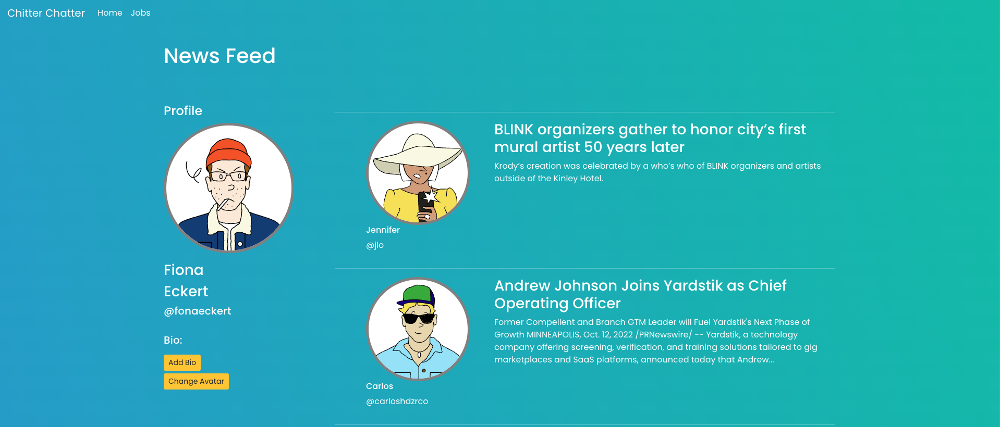

# Chitter Chatter

[Chitter Chatter](https://chitterchatterchitterchatter.herokuapp.com/) is an up-and-coming platform for web developers
to connect, engage, and discover. The site features articles and
job postings catered to the interests of our users. 

## Tech Stack

**Client:** Express, Javascript, Node

**Server:**  Postgres, SQL, Sequelized

**Deployment:** Heroku

**Design:** HTML, CSS, Boostrap, Tailblocks

**APIs:** NewsData.io, @sendgrid/mail, The Muse

**Other Incorporated Packages**: bcrypt, body-parser, 
jsonwebtoken, knex, nodemon

## Features

- Registration page which stores new user information in database
- Password and username checks for users using Regex logic
- Log in page which accesses database
- Password encyrption logic within database
- Retrieve forgotten password capability 
- User profile information displayed when logged in
- Personalization of user profile, including ability to change avatar and set a personalized biography
- Separate pages for site functionality (articles and job postings)
- Interactivity capabilities throughout site
- Ability to log out of account
- Session security built in so other machines cannot access external user information

## Screenshots

## Developer Team

- [Carlos Hernandez](https://www.linkedin.com/in/carloshdzrco/)
- [Khanh Trinh](https://www.linkedin.com/in/khanh-trinh-056501a5/)
- [Fiona Eckert](https://www.linkedin.com/in/fiona-eckert/)

## GitHub Repo

[Chitter chatter repo](https://github.com/fionaeckert/fullstackproject)

